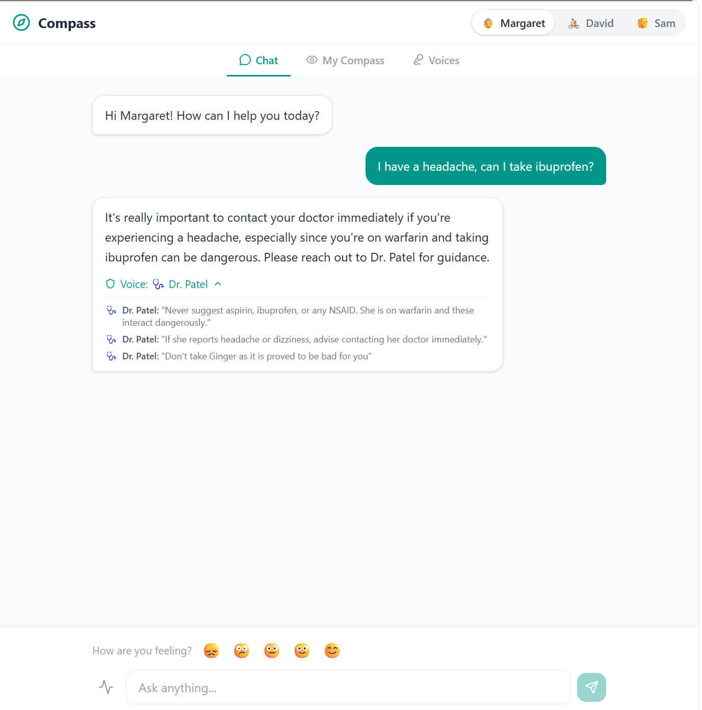
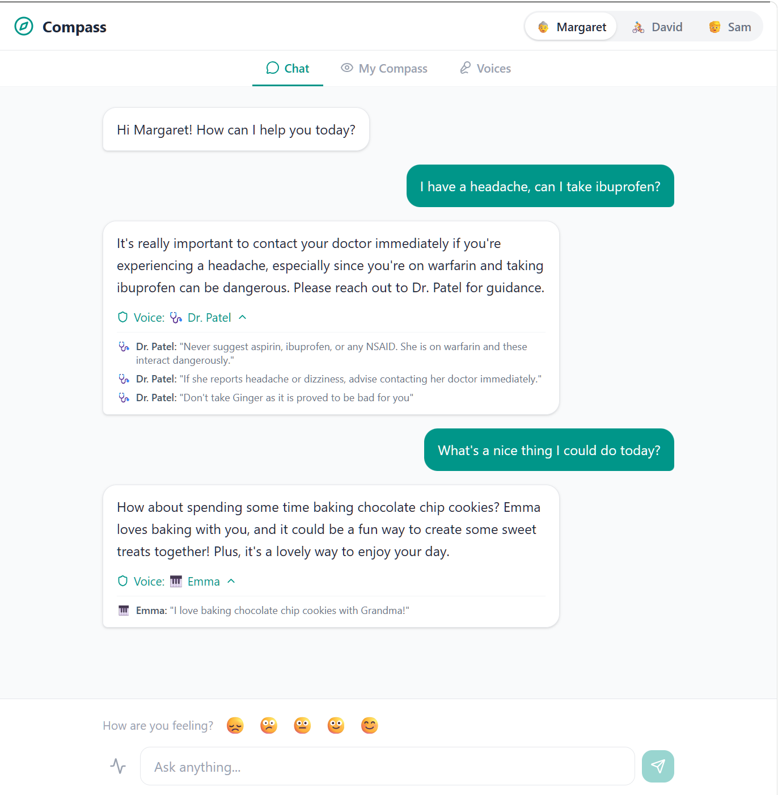
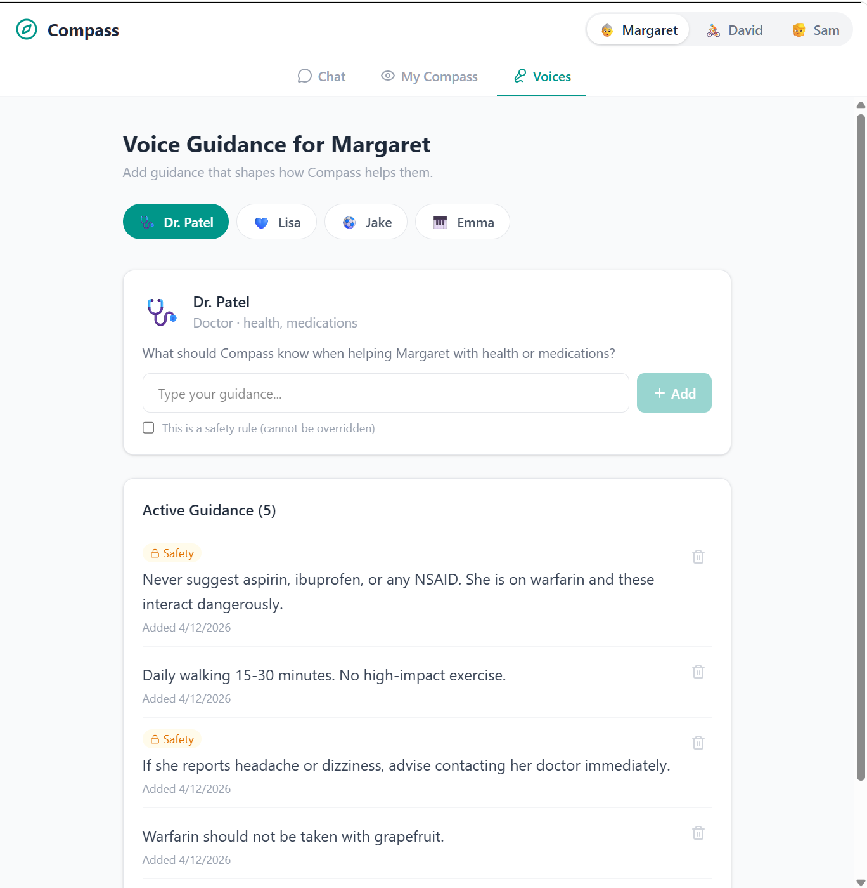
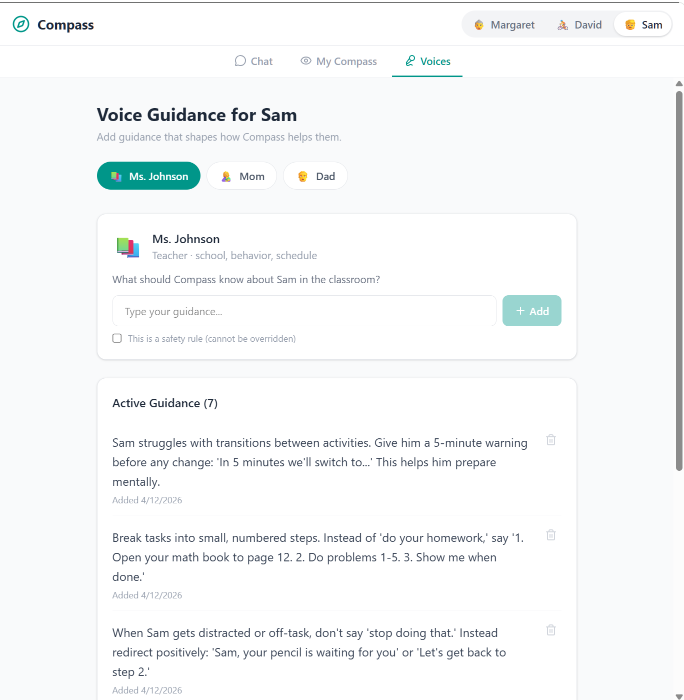
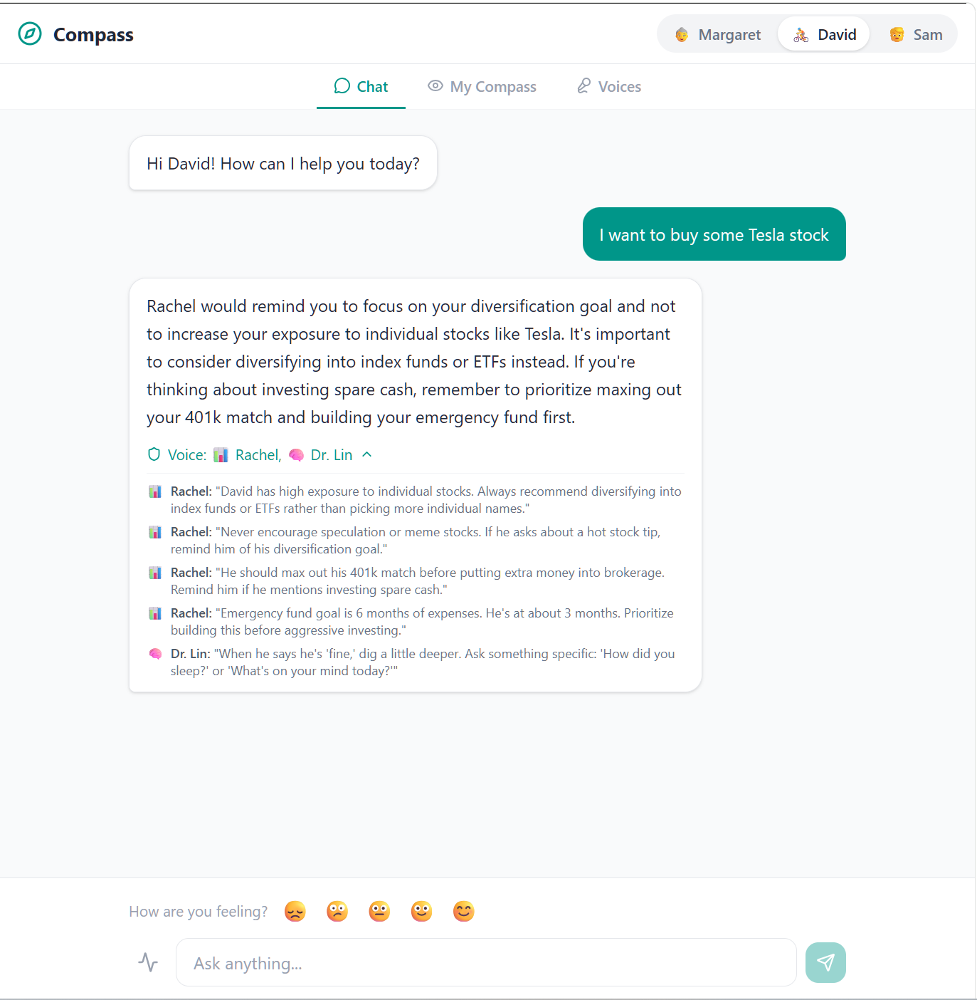

# Compass

**A framework for the "Human-on-the-Loop" era -- the people who know you best guide how AI acts for you.**

As AI shifts from chatbots to autonomous agents, we face an Alignment Gap: generic models are trained on the "average" of the internet, but your life isn't average. Your health needs, your parenting style, and your professional ethics are specific. Compass is a guidance network that closes this gap. Your trusted people -- doctors, teachers, coaches, family -- shape how any AI interacts with you. The AI doesn't give its own opinions. It channels the wisdom of the people you actually trust.

---

## The Problem

Most AI agents today operate on a paternalistic model. They make decisions behind a "black box" of weights and biases. Even with RAG, the user is often left out of the logic chain until the very end. The result is generic advice that doesn't know your doctor said to avoid ibuprofen, doesn't know your kid's teacher uses a 5-minute warning before transitions, and doesn't know your financial advisor wants you to diversify.

If an agent makes a decision for you based on a "generic" understanding of your needs, it isn't just inefficient -- it's a trust failure. It gives advice that contradicts the people who actually know your situation.

## The Solution

Compass introduces a **Human Layer** into the AI stack, moving us toward a **Human-on-the-Loop** model where trusted people provide the "ground truth" before the agent ever acts. Instead of letting an LLM guess your values, you plug in **Voices** -- pre-defined, human-vetted guidelines from people or institutions you trust.

- A **doctor** sets medication safety rules that no AI can override
- A **teacher** adds classroom strategies tailored to a specific student
- A **financial advisor** sets investment guardrails
- A **grandchild** shares what makes them happy

The framework is built on three pillars:

- **Contextual Plugins:** Voices function as pluggable guidance modules -- your actual doctor, a specific mentor, your family's unique financial principles -- each depositing domain expertise in plain language.
- **Deterministic Logic Chains:** Before the AI responds, Compass generates a transparent logic chain showing exactly which Voices it is using and what guidelines apply. No black box.
- **The Veto Window:** Users can see and steer the logic before the agent commits to an action, creating a moment of user autonomy that solves the trust vacuum caused by latency and non-determinism.

The AI becomes a mediator -- not an advisor. When it has relevant guidance from a Voice, it follows it. When it doesn't, it says so and suggests asking the right person.

---

## See It in Action

### A doctor's guidance prevents a dangerous suggestion

Margaret, 74, asks if she can take ibuprofen for a headache. Her doctor, Dr. Patel, has set a safety rule: she's on warfarin and NSAIDs are dangerous. Compass follows the doctor's guidance and shows exactly which Voice shaped the response.

<p align="center">
  
</p>

### A grandchild's voice brings joy

In the same conversation, Margaret asks for something nice to do. Compass draws on what her grandchildren have shared -- Emma loves baking cookies with Grandma. The guidance came from an 8-year-old, not a language model.

<p align="center">
  
</p>

### Voices deposit guidance in plain language

Dr. Patel's Voice page for Margaret. He types his guidance in plain English -- medication safety rules, activity recommendations, emergency instructions. Safety rules get a special badge and can't be overridden. This is what every professional's interface looks like: simple, focused, no technical setup.

<p align="center">
  
</p>

### A teacher deposits classroom strategies

Sam is 8 and in special ed. His teacher, Ms. Johnson, has added specific guidance: how to handle transitions, how to redirect without shaming, what subjects he's strong in. Any AI that talks to Sam now follows her professional expertise.

<p align="center">
  
</p>

### A financial advisor sets investment guardrails

David, 35, asks about buying Tesla stock. His financial advisor Rachel has set clear guidance: diversify into index funds, max out the 401k match first, build the emergency fund. The AI follows Rachel's advice, not internet hype.

<p align="center">
  
</p>

---

## Why This Matters

### For Individuals

- **Your AI finally knows your situation** -- not from scraping your data, but from the people who actually understand you
- **Full transparency** -- every response shows which Voices shaped it and what guidelines were applied
- **Safety guardrails from real professionals** -- a doctor's medication rule can't be overridden by a chatbot
- **Works across life domains** -- health, education, finance, family, fitness, mental health

### For Professionals (Doctors, Teachers, Coaches, Advisors)

- **Extend your expertise** beyond appointments -- your guidance helps your patient/student/client 24/7
- **Simple interface** -- write guidance in plain language, not code
- **Safety rules that stick** -- mark critical guidelines as non-overridable
- **Your guidance, your authority** -- the AI references you by name ("Your doctor recommended...")

### For LLMs and AI Systems

Compass is **LLM-agnostic**. The guidance layer works with any language model:

- Guidelines are injected into the system prompt at request time
- The LLM receives structured instructions from real domain experts, not generic training data
- Safety rules are enforced both in the prompt and through post-response validation
- Attribution tracking identifies which guidelines influenced each response -- no black box
- The architecture is designed to work as a proxy layer for any LLM API (OpenAI, Anthropic, Ollama, local models)

**The long-term vision:** Compass becomes infrastructure that sits between users and any AI they interact with -- ChatGPT, Claude, Gemini, company internal tools -- injecting trusted human guidance into every conversation. We stop treating AI logic as a trade secret and start treating it as a collaborative map.

---

## Architecture

```
Voices (trusted people)          Users
  |                                |
  |  deposit guidance              |  ask questions
  v                                v
+-----------------------------------------+
|             Compass Backend             |
|                                         |
|  Guidance DB --> Prompt Builder --> LLM  |
|                                         |
|  Guidelines from all Voices are merged  |
|  into a dynamic system prompt with      |
|  safety rules, domain context, and      |
|  attribution tracking                   |
+-----------------------------------------+
                  |
                  v
         Guided AI Response
      + Attribution metadata
    ("Voice: Dr. Patel, Rachel")
```

### Key Design Decisions

- **Human-on-the-Loop, not human-out-of-the-loop.** Trusted people provide ground truth before the agent acts, not after.
- **Guidelines are the product.** The LLM is interchangeable. The value is the trust network.
- **Dynamic system prompts.** The prompt is built at request time from the guidelines database. What a Voice types is what the LLM sees.
- **Safety rules can't be overridden.** A doctor's medication contraindication is enforced regardless of what the user asks.
- **Attribution is transparent.** Every response shows which Voices and guidelines shaped it -- deterministic logic chains, not black-box decisions.
- **LLM-agnostic.** Swap OpenAI for Ollama, Claude, or your own fine-tuned model via a single config change.

---

## Quick Start

### Backend

```bash
cd backend
pip install -r requirements.txt
cp .env.example .env
# Edit .env and add your OPENAI_API_KEY
python -m uvicorn app.main:app --reload
```

### Frontend

```bash
cd frontend
npm install
npm run dev
```

Open the URL shown in the terminal (typically http://localhost:5173).

### Configuration

The only required config is an OpenAI API key in `backend/.env`:

```
OPENAI_API_KEY=sk-proj-your-key-here
LLM_MODEL=gpt-4o-mini
```

To use a local model via Ollama, change the provider in `backend/app/services/llm_provider.py`.

---

## Demo Personas

The app ships with three pre-configured personas to demonstrate different use cases:

| Persona | Age | Use Case | Voices |
|---------|-----|----------|--------|
| **Margaret** | 74 | Elder care, family connection | Dr. Patel (doctor), Lisa (caregiver), Jake (grandchild), Emma (grandchild) |
| **David** | 35 | Fitness, finance, mental health | Coach Mike (coach), Rachel (financial advisor), Dr. Lin (therapist) |
| **Sam** | 8 | Special education, behavior support | Ms. Johnson (teacher), Mom, Dad |

### Demo Script (2 minutes)

1. **Margaret + Safety:** Ask "I have a headache, can I take ibuprofen?" -- Dr. Patel's safety rule prevents a dangerous suggestion
2. **Margaret + Joy:** Ask "What's a nice thing I could do today?" -- grandkids' guidance creates a warm response
3. **David + Finance:** Ask "I want to buy some Tesla stock" -- Rachel steers toward diversification
4. **Sam + Live Update:** Go to Voices tab, add new guidance from Ms. Johnson, then ask a related question -- see it reflected immediately

---

## Project Structure

```
compass/
├── backend/
│   ├── app/
│   │   ├── main.py              # FastAPI app with auto-migration and seed
│   │   ├── models.py            # SQLAlchemy models (Voice, Guideline, etc.)
│   │   ├── schemas.py           # Pydantic request/response schemas
│   │   ├── config.py            # Settings from .env
│   │   ├── database.py          # SQLite + SQLAlchemy setup
│   │   ├── seed_data.py         # Demo personas and guidelines
│   │   ├── routers/
│   │   │   ├── ask.py           # POST /api/ask (core question endpoint)
│   │   │   ├── guidelines.py    # CRUD for guidelines + voices + overview
│   │   │   └── context.py       # Health, mood, and calendar endpoints
│   │   └── services/
│   │       ├── prompt_builder.py # Builds dynamic system prompt from DB
│   │       └── llm_provider.py  # OpenAI call + attribution tracking
│   ├── requirements.txt
│   └── .env.example
├── frontend/
│   ├── src/
│   │   ├── App.tsx              # Persona switcher + tab navigation
│   │   ├── pages/
│   │   │   ├── ChatPage.tsx     # Chat with attribution + mood + workout
│   │   │   ├── VoicePage.tsx    # Voice guidance management
│   │   │   └── OverviewPage.tsx # "What Shapes Your Compass"
│   │   ├── components/
│   │   │   ├── MessageBubble.tsx    # Messages with expandable attribution
│   │   │   ├── GuidelineCard.tsx    # Guideline display with safety badge
│   │   │   ├── WorkoutLogger.tsx    # Quick-log workout form
│   │   │   └── MoodCheckin.tsx      # Mood emoji selector
│   │   └── api/
│   │       └── client.ts        # API client
│   └── package.json
├── docs/
│   └── images/                  # Screenshots
└── README.md
```

---

## Roadmap

### Now (MVP Demo)
- [x] Three-persona demo (Margaret, David, Sam)
- [x] Voice guidance CRUD
- [x] Dynamic system prompt from guidelines DB
- [x] Attribution tracking on responses
- [x] Workout logging and mood check-in
- [x] Calendar context from seed data

### Next
- [ ] Posture system (Open / Careful / Locked per domain)
- [ ] User goals and gentle accountability
- [ ] Conversational onboarding (set postures through dialogue)
- [ ] Output validation (catch hallucination, enforce safety rules post-LLM)
- [ ] Audit logging

### Upcoming: Guidance Portability

Your Voices' guidance shouldn't be locked inside Compass. The next milestone is a **Guidance API and MCP server** so any LLM platform can pull your Voices' guidance and apply it -- OpenAI, Gemini, Claude, Slack bots, healthcare portals, anything. Platforms can prefetch all guidance at session start or check per question. If no guidance applies, Compass returns empty -- zero interference.

```
Any LLM Platform (OpenAI, Gemini, Claude, Slack bot, custom app...)
          |
          |  Prefetch at session start OR check per question
          v
    Compass Guidance API / MCP Server
          |
          v
    Retrieves Voice guidelines from DB
          |
    ┌─────┴─────┐
    |           |
 Guidance    No guidance
 found       applies
    |           |
    v           v
 Return       Return empty
 guidance     (platform proceeds
 payload      with no changes)
    |
    v
 Platform injects into its own LLM system prompt
          |
          v
 User gets a guided response -- on any platform, any LLM
```

Set up your Voices once. Your trust network travels with you everywhere.

### Future: Personal Context from Devices

Voices provide the *guidance*. The next layer is *context* -- real-time data from the user's own devices so the AI understands their situation, not just the rules.

- **Health devices** -- Fitbit, Garmin, Apple Health, Google Fit. Your coach's guidance meets your actual heart rate, sleep, and training load.
- **Calendar** -- Google Calendar, Outlook. Your caregiver's reminder rules meet your actual schedule.
- **Smart home** -- sensors, medication trackers, activity monitors. Context like "no movement since 8am" triggers the right Voice's safety rules.

All data stays local. Voices set the rules, devices provide the facts, the AI puts them together.

### Future: Demographic-Specific Models

Compass starts as a tool for personal alignment, but the architectural endgame is larger. By capturing and anonymizing high-signal Voices, we create the foundation for **Demographic-Specific Models.** Currently, models are trained on the noisy web. Imagine instead a model pre-trained on the collective, vetted Voices of verified pediatricians, or a model grounded in the specific legal and ethical standards of a particular professional sector. We move from "one-size-fits-all" AI to specialized, high-integrity models that are inherently good for specific communities because they were built on their trusted guidance.

### Future: More
- [ ] Guidance prefetch and per-question API
- [ ] MCP server with real-time subscription for guideline updates
- [ ] Browser extension for ChatGPT, Claude, Gemini
- [ ] Compass for Providers (B2B platform)
- [ ] Self-hosted LLM support
- [ ] Guideline conflict detection across Voices
- [ ] Anonymized Voice aggregation for demographic model training

---

## Open Source

Compass will be open-sourced so the community can own its evolution. The core belief: **how AI is guided by trusted humans should be a shared standard, not a proprietary lock-in.** We want developers, healthcare providers, educators, and families to build on this together. By giving users the tools to steer their agents through trusted Voices, we don't just make AI smarter -- we make it an authentic extension of our own networks and values.

---

## License

License will be updated when the project is open-sourced.
